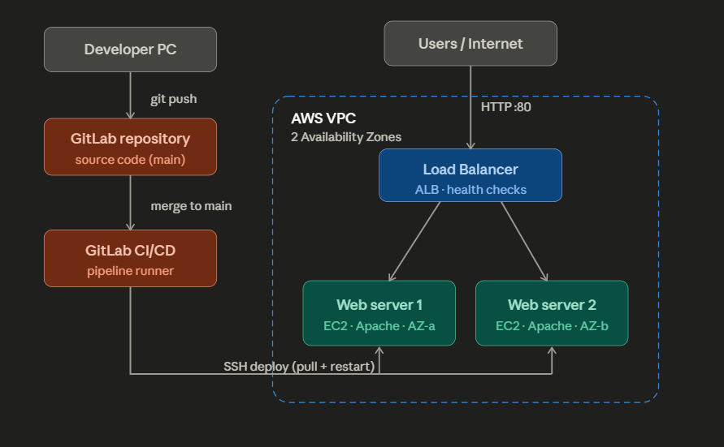

# Highly Available CI/CD Web Infrastructure on AWS

> A self-directed cloud engineering project in which I designed, built, and deployed a fault-tolerant web platform on AWS with automated GitLab CI/CD delivery, containerization, multi-AZ load balancing, and security hardening.
  


I built this project on my own to deepen my hands-on skills in cloud architecture, DevOps automation, and infrastructure security. The goal was to take a single web application and make it **highly available**, **automatically deployable**, and **secure**, using the same building blocks used in production environments.

---

## Table of Contents

- [Overview](#overview)
- [Architecture](#architecture)
- [Key Features](#key-features)
- [Tech Stack](#tech-stack)
- [Repository Structure](#repository-structure)
- [Prerequisites](#prerequisites)
- [Implementation Guide](#implementation-guide)
  - [1. Networking and Security Baseline](#1-networking-and-security-baseline)
  - [2. EC2 Web Servers (Multi-AZ)](#2-ec2-web-servers-multi-az)
  - [3. Containerization with Docker](#3-containerization-with-docker)
  - [4. Load Balancing and High Availability](#4-load-balancing-and-high-availability)
  - [5. Static Website Hosting on Amazon S3](#5-static-website-hosting-on-amazon-s3)
  - [6. CI/CD Pipeline with GitLab](#6-cicd-pipeline-with-gitlab)
  - [7. Security Hardening](#7-security-hardening)
- [High Availability Demonstration](#high-availability-demonstration)
- [Screenshots](#screenshots)
- [Skills Demonstrated](#skills-demonstrated)
- [Future Improvements](#future-improvements)
- [Author](#author)
- [License](#license)

---

## Overview

This project provisions a small but production-style web platform on AWS. Application code lives in a Git repository, and every change merged to the `main` branch is automatically delivered to the running servers by a CI/CD pipeline — no manual deployment steps.

User traffic enters through an **Application Load Balancer (ALB)**, which spreads requests across **two EC2 web servers placed in two separate Availability Zones**. The ALB continuously health-checks the servers and routes traffic only to healthy targets, so the application keeps serving even if one server (or an entire Availability Zone) goes down.

The platform also includes a containerized NGINX workload, an Amazon S3 static website, fully documented networking, and SSH/secret-management hardening.

---

## Architecture



**Request flow (runtime):**

```
Users / Internet ──HTTP:80──> Application Load Balancer ──> EC2 Web Server 1 (AZ-a)
                                                       └──> EC2 Web Server 2 (AZ-b)
```

**Deployment flow (CI/CD):**

```
Developer ──git push──> Git Repository ──merge to main──> GitLab CI/CD Pipeline
                                                              │ (SSH)
                                                              ▼
                                          EC2 Web Servers: git pull + redeploy + restart
```

Both web servers sit inside a single VPC but in different Availability Zones, which is what provides the high-availability guarantee.

---

## Key Features

- **Zero-downtime, automated deployments** — merges to `main` trigger a CI/CD pipeline that deploys to all servers over SSH.
- **High availability** — two web servers across two Availability Zones behind an Application Load Balancer with health checks and automatic failover.
- **Containerization** — a Docker-managed NGINX workload running alongside the host web server.
- **Infrastructure as evidence** — reproducible Bash bootstrap (EC2 user data), declarative pipeline (`.gitlab-ci.yml`), and an explicit S3 bucket policy.
- **Static asset hosting** — a public website served directly from Amazon S3.
- **Security first** — SSH key-only authentication, password login disabled, and pipeline secrets stored as protected CI/CD variables (never in source control).

---

## Tech Stack

| Layer | Technology |
|-------|-----------|
| Compute | Amazon EC2 (Amazon Linux 2023, `t3.micro`) |
| Web server | Apache HTTP Server (`httpd`) |
| Containerization | Docker, official NGINX image |
| Load balancing / HA | AWS Application Load Balancer, Target Groups, Health Checks, Multi-AZ |
| Storage / hosting | Amazon S3 static website hosting |
| Networking | Amazon VPC, Subnets, Internet Gateway, Route Tables, Security Groups |
| CI/CD | GitLab CI/CD, GitLab Runners |
| Automation | Bash scripting (EC2 user data) |
| Security | SSH key authentication, protected CI/CD secrets |

---

## Repository Structure

```
.
├── README.md
├── docs/
│   ├── architecture.png            # architecture diagram
│   └── screenshots/                # console + browser evidence
├── app/
│   ├── index.template.html         # deployable web page (templated)
│   └── .gitlab-ci.yml              # CI/CD pipeline definition
├── docker/
│   └── docker-compose.yml          # containerized NGINX workload
├── infrastructure/
│   ├── user-data-web-server.sh     # EC2 bootstrap script
│   └── bucket-policy.json          # S3 public-read policy
└── LICENSE
```

---

## Prerequisites

- An AWS account (the Application Load Balancer is **not** free-tier eligible — tear resources down after testing to avoid charges).
- A GitLab account for the source repository and CI/CD runners.
- A terminal with `ssh` and `git`.
- Basic familiarity with the AWS Console and the Linux command line.

---

## Implementation Guide

### 1. Networking and Security Baseline

The default VPC is used, with a dedicated security group acting as the instance firewall.

**Security group inbound rules:**

| Type | Protocol | Port | Source | Purpose |
|------|----------|------|--------|---------|
| SSH | TCP | 22 | My IP | Secure administrative access |
| HTTP | TCP | 80 | 0.0.0.0/0 | Public + load balancer access |
| Custom TCP | TCP | 8080 | My IP | Docker NGINX verification |

An RSA key pair (`cloud-cw-key.pem`) was generated for SSH access and its permissions locked down locally:

```bash
chmod 400 cloud-cw-key.pem
```

### 2. EC2 Web Servers (Multi-AZ)

Two `t3.micro` instances running Amazon Linux 2023 were launched in **two different Availability Zones**. Each instance is bootstrapped automatically at first boot using the user-data script below, which installs Apache and Git and publishes a page that reports the serving host.

`infrastructure/user-data-web-server.sh`:

```bash
#!/bin/bash
dnf update -y
dnf install -y httpd git
systemctl start httpd
systemctl enable httpd

echo "<!DOCTYPE html>
<html>
<head><title>Highly Available Cloud App</title></head>
<body>
  <h1>Highly Available Cloud Application</h1>
  <p>This server is part of a load-balanced, multi-AZ deployment on AWS.</p>
  <p>Served by: \$(hostname)</p>
</body>
</html>" > /var/www/html/index.html
```

Connecting to each instance for verification:

```bash
ssh -i cloud-cw-key.pem ec2-user@<WEB_SERVER_1_PUBLIC_IP>
ssh -i cloud-cw-key.pem ec2-user@<WEB_SERVER_2_PUBLIC_IP>
```

Each server is then reachable at `http://<WEB_SERVER_PUBLIC_IP>` and returns a page identifying the host that served it — which makes load balancing visible later.

### 3. Containerization with Docker

A containerized NGINX workload runs on the host and is exposed on port `8080`, so it does not collide with Apache on port `80`.

```bash
sudo dnf install -y docker
sudo systemctl start docker
sudo systemctl enable docker
sudo usermod -aG docker ec2-user
newgrp docker

docker --version
sudo systemctl status docker

docker pull nginx
docker run -d -p 8080:80 --name my-nginx nginx
docker ps
```

The container is verified in a browser at `http://<EC2_PUBLIC_IP>:8080`.

The same workload is also captured declaratively for reproducibility — `docker/docker-compose.yml`:

```yaml
services:
  web:
    image: nginx:latest
    container_name: my-nginx
    ports:
      - "8080:80"
    restart: unless-stopped
```

```bash
docker compose up -d
```

### 4. Load Balancing and High Availability

1. **Target group** (`web-tg`) — type *Instances*, protocol `HTTP:80`, health check path `/`. Both EC2 instances are registered.
2. **Application Load Balancer** — internet-facing, spanning **two Availability Zones**, with an `HTTP:80` listener that forwards to the target group.
3. The ALB health-checks each target continuously and routes only to healthy instances.

Once the targets report **healthy**, the application is served from the load balancer's DNS name:

```
http://<ALB_DNS_NAME>.elb.amazonaws.com
```

Refreshing the page alternates the reported hostname, confirming traffic is being balanced across both servers.

### 5. Static Website Hosting on Amazon S3

A separate static site is hosted directly from Amazon S3:

1. Create a bucket with a globally unique name in the chosen region.
2. Disable *Block all public access* (required for public static hosting).
3. Enable **Static website hosting** with `index.html` as the index document.
4. Apply a public-read bucket policy.

`infrastructure/bucket-policy.json`:

```json
{
  "Version": "2012-10-17",
  "Statement": [
    {
      "Sid": "PublicReadGetObject",
      "Effect": "Allow",
      "Principal": "*",
      "Action": "s3:GetObject",
      "Resource": "arn:aws:s3:::<YOUR_BUCKET_NAME>/*"
    }
  ]
}
```

Example `index.html` for the S3 site:

```html
<!DOCTYPE html>
<html lang="en">
<head>
  <meta charset="UTF-8">
  <title>Cloud Project - S3 Static Site</title>
</head>
<body>
  <h1>AWS Cloud Infrastructure Project</h1>
  <p>This page is hosted on Amazon S3 static website hosting.</p>
</body>
</html>
```

### 6. CI/CD Pipeline with GitLab

Application code is stored in a GitLab repository (`cloud-cw-app`). The deployable page is templated so each server can stamp its own hostname at deploy time.

`app/index.template.html`:

```html
<!DOCTYPE html>
<html lang="en">
<head><title>Highly Available Cloud App</title></head>
<body>
  <h1>Highly Available Cloud Application</h1>
  <p>Deployed automatically via GitLab CI/CD.</p>
  <p>Served by: {{SERVER}}</p>
  <p>Version: v1</p>
</body>
</html>
```

**Server-side setup (run once per instance).** The repository is cloned into `~/app` using a GitLab **deploy token** with read-only scope. The token is referenced from an environment value and is never committed:

```bash
cd ~
git clone https://<DEPLOY_TOKEN_USERNAME>:<DEPLOY_TOKEN>@gitlab.com/<gitlab-username>/cloud-cw-app.git app
```

**Pipeline definition** — `app/.gitlab-ci.yml`. It runs only on `main`, loads the SSH key from a protected variable, then for each server pulls the latest code, renders the page with that server's hostname, and restarts the web service:

```yaml
stages:
  - deploy

deploy:
  stage: deploy
  image: alpine:latest
  only:
    - main
  before_script:
    - apk add --no-cache openssh-client
    - eval $(ssh-agent -s)
    - echo "$SSH_PRIVATE_KEY" | tr -d '\r' | ssh-add -
    - mkdir -p ~/.ssh && chmod 700 ~/.ssh
  script:
    - |
      for HOST in "$WEB_SERVER_1" "$WEB_SERVER_2"; do
        ssh -o StrictHostKeyChecking=no ec2-user@$HOST "
          cd ~/app &&
          git pull origin main &&
          sed \"s/{{SERVER}}/\$(hostname)/g\" index.template.html | sudo tee /var/www/html/index.html >/dev/null &&
          sudo systemctl restart httpd
        "
      done
```

**Protected CI/CD variables** (set in *Settings -> CI/CD -> Variables*, never in code):

| Variable | Purpose |
|----------|---------|
| `SSH_PRIVATE_KEY` | Private key used to SSH into the EC2 instances |
| `WEB_SERVER_1` | Public address of web server 1 |
| `WEB_SERVER_2` | Public address of web server 2 |

> **Security note:** deploy tokens and SSH keys are credentials. Store them only as **masked/protected** CI/CD variables and rotate them if they are ever exposed.

### 7. Security Hardening

- **SSH key-only authentication.** Login is restricted to the generated key pair.
- **Password and root login disabled** on the servers:

  ```bash
  echo -e "PasswordAuthentication no\nPermitRootLogin no" | sudo tee /etc/ssh/sshd_config.d/99-hardening.conf
  sudo systemctl restart sshd
  sudo sshd -T | grep -iE "passwordauthentication|permitrootlogin"
  ```

- **Least-privilege networking.** SSH is restricted to a single administrative IP; only HTTP is publicly exposed.
- **Secret management.** Pipeline credentials live exclusively in protected CI/CD variables.

---

## High Availability Demonstration

To prove resilience, the web service is stopped on one server:

```bash
sudo systemctl stop httpd
```

Within seconds the target group marks that instance **unhealthy**, yet the site stays online because the load balancer routes all traffic to the remaining healthy server. Restarting the service returns the target to **healthy** and traffic rebalances:

```bash
sudo systemctl start httpd
```

---

## Screenshots

Evidence is stored in `docs/screenshots/`:

- EC2 instances running across two Availability Zones
- Security group inbound rules
- Docker container running and verified in a browser
- Target group with healthy targets
- Application Load Balancer with its DNS name
- Failover test (one target unhealthy, site still serving)
- S3 bucket, static hosting configuration, and live page
- VPC, subnets, internet gateway, and route table
- GitLab repository, pipeline configuration, and pipeline run

---

## Skills Demonstrated

- Designing multi-AZ, fault-tolerant architectures on AWS.
- Building automated CI/CD pipelines and SSH-based deployment workflows.
- Containerizing workloads with Docker and Docker Compose.
- Configuring cloud networking (VPC, subnets, gateways, route tables, security groups).
- Hosting static content on Amazon S3 with explicit IAM/bucket policies.
- Applying security best practices: key-based SSH, disabled password login, and protected secrets.
- Documenting infrastructure clearly and reproducibly.

---

## Future Improvements

- Replace manual console steps with **Infrastructure as Code** (Terraform or AWS CloudFormation).
- Add an **Auto Scaling Group** so capacity adjusts automatically to traffic.
- Terminate HTTPS at the ALB with **AWS Certificate Manager**.
- Add centralized monitoring and alerting with **Amazon CloudWatch**.
- Introduce a **blue/green or rolling deployment** strategy for safer releases.

---

## Author

**Janiru Sudasinghe**

- GitHub: [@your-username](https://github.com/your-username)
- LinkedIn: [your-profile](https://linkedin.com/in/your-profile)

This was a personal, self-directed project built to strengthen my practical cloud and DevOps engineering skills.

---

## License

This project is licensed under the MIT License — see the [LICENSE](LICENSE) file for details.
